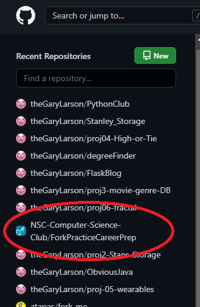
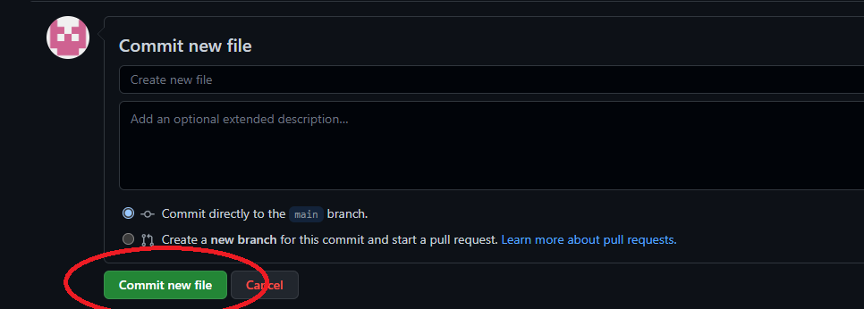

Hello everyone and welcome to our club repository! This is a generalized Git Workflow to help gain the skills to collaborate on open source projects. Here you can follow the instructions below to learn how to make a copy of a project from a public repository. Then create changes in your copy on GitHub or download it to your computer to make changes. Last, submit those changes back to the original repository for approval. 

The **GitHub UI Instructions** will allow you to follow along and make changes within the browser. However you are encouraged to take a deeper dive and use the Git Bash **Terminal commands**. This will allow you to work on the project within your preferred IDE on your computer.  If this is something you want to try just follow along with the additional steps listed within step 2. Good luck!

If you have any questions or need help you can message us within our <a href="https://discord.gg/xfeXTySSbX" target="_blank">Club Discord</a>.

> For an overview of terminal commands check out this <a href="https://www.youtube.com/watch?v=UDlIJkvOOPw&list=PL6k4gMRDdFjhHvq9Oulmyph2LezQMU4lg&index=3&t=2s" target="_blank">video</a> our club member Beck created.

# GitHub Workflow

---
### GitHub UI Instructions
---

1. Fork this repository 
   *Done from NSC GitHub Repository (click link below)*  
   <a href="https://github.com/NSC-Computer-Science-Club/ForkPracticeCareerPrep" target="_blank">https://github.com/NSC-Computer-Science-Club/ForkPracticeCareerPrep</a>
   &nbsp;&nbsp;&nbsp;&nbsp;&nbsp; 

2. The repo will appear under your profile. Click this repository (We will do our work from here).

   &nbsp;&nbsp;&nbsp;&nbsp;&nbsp; 

   > *For a Deeper dive Using Git Bash command line. Follow Steps **A** thru **G** Under **Terminal Commands*** below

3. Click the green "Add file" button. Select "Create new file"  
  &nbsp;&nbsp;&nbsp;&nbsp;&nbsp;

4. At the top of the file will be a textbox to name your file. Include the subfolder. Typing the name of the subfolder and then a forward-slash will indicate a new folder. Then type readme.md

 &nbsp;&nbsp;&nbsp;&nbsp;&nbsp; 
 &nbsp;&nbsp;&nbsp;&nbsp;&nbsp; 

5. Then add markdown of your choosing to illustrate what you learned. Here is a <a href="https://docs.github.com/en/get-started/writing-on-github/getting-started-with-writing-and-formatting-on-github/basic-writing-and-formatting-syntax" target="_blank">GitHub reference</a> to help with markdown.

6. Once you are satisfied with your changes. Save your file by scrolling down and clicking the green "Commit new file" button.

&nbsp;&nbsp;&nbsp;&nbsp;&nbsp; 

7. <a name="Step">From your GitHub Profile submit a pull request</a>
  &nbsp;&nbsp;&nbsp;&nbsp;&nbsp; 

---
### Terminal Commands
---
**Switch to the Git Bash terminal**

   On your computer navigate to the folder where you want to store your copy within the Git Bash terminal. Cloning will create a subfolder including all the files within the repository.

  &nbsp;&nbsp;&nbsp;&nbsp;&nbsp; A. Clone this repository `git clone https://github.com/NSC-Computer-Science-Club/ForkPracticeCareerPrep.git`

  &nbsp;&nbsp;&nbsp;&nbsp;&nbsp;&nbsp;&nbsp;&nbsp;&nbsp;&nbsp; 

**Switch to your file management system**

  &nbsp;&nbsp;&nbsp;&nbsp;&nbsp; B. Create a subfolder within this copied repository. Name it your GitHub profile user name.

  &nbsp;&nbsp;&nbsp;&nbsp;&nbsp; C. In this folder create a README.md file

  &nbsp;&nbsp;&nbsp;&nbsp;&nbsp; D. Open this file and add your markdown and save the file.

**Switch to the GitBash terminal**

 &nbsp;&nbsp;&nbsp;&nbsp;&nbsp; E. add your changes from the terminal `git add .`

 &nbsp;&nbsp;&nbsp;&nbsp;&nbsp; F. Commit your changes `git commit -m "My created subfolder with markdown file."`

 &nbsp;&nbsp;&nbsp;&nbsp;&nbsp; G. Push your changes to your GitHub Profile repository `git push origin main`

> Continue with <a href="/README.md/#Step">**step 7**</a> above

---
### References
---
<a href="https://docs.github.com/en/get-started/writing-on-github/getting-started-with-writing-and-formatting-on-github/basic-writing-and-formatting-syntax">GitHub Markdown Reference Guide</a> 
Link to Beck’s Git Intro Video: <a href="https://www.youtube.com/watch?v=UDlIJkvOOPw&list=PL6k4gMRDdFjhHvq9Oulmyph2LezQMU4lg&index=3&t=2s">Working Together with Github - 30 Minute Virtual TechBytes</a> 
Link to GitHub Profile Generator: https://rahuldkjain.github.io/gh-profile-readme-generator/ 
Link to Good First Issue: https://goodfirstissues.com/ 
Link to Fork Me Repo: https://github.com/atapas/fork-me with <a href="https://www.youtube.com/watch?v=h8suY-Osn8Q">YouTube video walkthrough</a> 
=======
Happy to have yall here :heart:

Good luck :smile:

